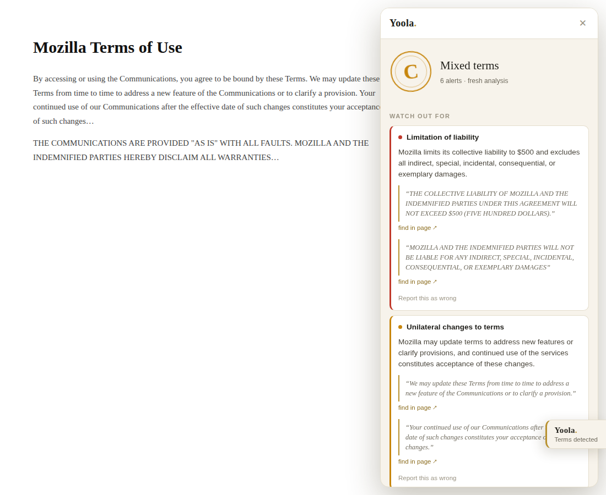

<div align="center">

# Yoola<sup>·</sup>

**The fine print, graded.**

Nobody reads the terms. Yoola reads them for the record — one click turns any
terms of service into a stamped verdict: a grade from **A to E**, the alarming
clauses first, every claim backed by a verbatim quote from the document.

[**Live directory**](https://aleksanderborodin.github.io/yoola_explain/) ·
[**API**](https://yoola-explain.aleksanderbor.ru/healthz) ·
[Design spec](Yoola_Design_v4.md) ·
[User guide](docs/user-guide.md) ·
[Docs](AGENTS.md)




</div>

---

## What it does

- **Detects legal pages quietly** — terms, privacy policies, EULAs — and signup
  forms that *link* to them. Detection runs entirely in your browser; nothing is
  sent anywhere until you click.
- **Summarizes on demand** into a fixed **14-clause checklist** (arbitration,
  auto-renewal, data sale, liability caps…), graded A–E, alarming clauses first.
- **Quotes everything.** A claim counts as *verified* only when the exact source
  sentence anchors it — click through and the clause is highlighted in the
  original. Anything uncertain is marked *possible*, honestly.
- **One reading serves everyone.** The server fetches the public document itself,
  analyzes it once, and caches it — every later visitor gets it instantly, and it
  joins the [public directory](https://aleksanderborodin.github.io/yoola_explain/).
- **Reviews linked terms without leaving the page** — on a registration form,
  Yoola summarizes the linked Terms/Privacy documents in place.

## Try it

**Browse:** the [directory](https://aleksanderborodin.github.io/yoola_explain/)
works in any browser — search a service, see its grade.

**Install the extension** (Chrome, developer build — store release coming):

1. `git clone https://github.com/aleksanderborodin/yoola_explain`
2. Open `chrome://extensions`, enable **Developer mode**
3. **Load unpacked** → select the `extension/` folder
4. Visit any terms page and click the **"Yoola · Terms detected"** tab
   (or right-click → *Summarize this page with Yoola*)

A first analysis of a new document takes about a minute; cached documents are
instant, for everyone.

## How it works

```
you click                        the Yoola server
    │  URL only ──────────────▶  fetch the public page itself (SSRF-guarded)
    │                            extract → hash → cache? ── hit ──▶ instant
    │                            plausibility gate → LLM legal-check
    │                            ONE checklist generation (14 clauses)
    │                            anchor every quote · cross-check omissions
    │                            verify claims · grade A–E
    ◀── stamped verdict ───────  cache for everyone + public directory
```

The design principle behind everything: **the cache is the product; the LLM is
the fallback.** Each document costs one generation ever; every request after is
a ~10 ms cache read. Trust comes from *server-observed content* — the server
fetches documents itself, so nobody can poison the shared cache — and from
grounding: unanchored quotes are dropped, unverifiable claims are downgraded,
reader reports mark summaries as disputed (never silently removed).

The full reasoning — including the challenge record of every design decision
that beat its alternatives — is in [Yoola_Design_v4.md](Yoola_Design_v4.md).

## Our own terms score a D

We ran Yoola on [Yoola's own terms of service](docs/legal/terms-of-service.md):
**D — harsh terms.** No warranties, liability capped at $10, no class actions.
Most software terms look like this; the difference is that we're the ones
telling you, with the clauses quoted, before you agree. That's the product.
The unedited output is in the [user guide](docs/user-guide.md#yoola-explained-by-yoola).

## Repository map

| Path | What |
|------|------|
| [`server/`](server/) | FastAPI backend — fetch, gates, generation pipeline, cache, budgets |
| [`extension/`](extension/) | Chrome MV3 extension, vanilla JS, no build step |
| [`site/`](site/) | The website (GitHub Pages) — landing + live directory |
| [`shared/taxonomy.json`](shared/taxonomy.json) | The 14-clause checklist both sides are built around |
| [`deploy/`](deploy/) | One-shot server setup (uv + systemd + Caddy) |
| [`docs/`](docs/) | Architecture, API contract, extension internals, gotchas, roadmap |
| [`Yoola_Design_v4.md`](Yoola_Design_v4.md) | The design spec + challenge record |
| [`AGENTS.md`](AGENTS.md) | Contracts index for contributors (and AI agents) |

## Development

```bash
# server (Python 3.12 + uv)
cd server && uv sync
cp env.example .env            # add an OpenAI-compatible LLM key
uv run uvicorn --factory yoola.app:create_app --port 8000

# tests
uv run pytest -m "not llm" -q  # fast, offline (<1 s)
uv run pytest -q               # + real-LLM integration tests

# extension against the local server: set API_BASE in extension/background.js
# to http://127.0.0.1:8000, then load extension/ unpacked
```

Every economic and trust claim has a test: generate-once-then-cache, cache
poisoning, budget exhaustion, prompt-injection resistance, report abuse,
quarantine of unverifiable sources. See [`server/tests/`](server/tests/).

## Deployment

One command on a fresh Ubuntu box — installs uv + Caddy (automatic HTTPS),
a hardened single-worker systemd service, and the firewall:

```bash
LLM_KEY=your-key bash deploy/server-setup.sh
```

Details in [docs/deploy.md](docs/deploy.md).

---

<div align="center">

*AI-generated summaries. Not legal advice. Verify against the original —
Yoola shows you exactly where to look.*

</div>
